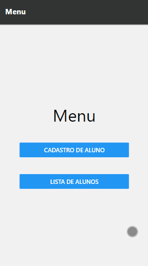
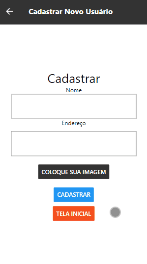
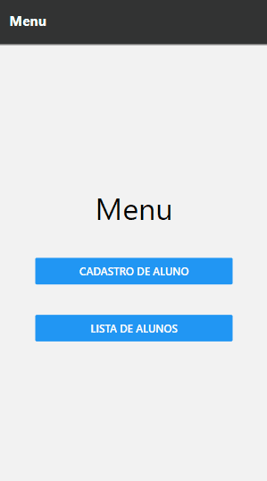

# 
React-Native-My-Projects

 

## 🔍 About

This is a repository with some of my projects on REACT NATIVE I hope you enjoy and fell free to use if you want!

 

## 🚀 The Projects

 

### 📱 CRUD made with React Native(frontEnd) and Node(backEnd) with MongoDb as database. <a href="#">Go to the project !</a>

 
 

 
 

### 📱 Basics of react native and a simple clone of instagram. With api Data. <a href="#">Go to the project !</a>

 
 

 
 

 
 

## ✨ Technologies used on this projects

 

<ul>
    <li> React Native
    <li> Styled-components
    <li> Html / Css
    <li> Rest api
    <li> Node.js
    <li> MongoDB
    <li> Heroku
</ul>

 

 

 
Made with ♥ by Gustavo Bacellar 👋 <a href="https://www.linkedin.com/in/gustavo-bacellar/?msgControlName=reply_to_sender&msgConversationId=6714883939833561088&msgOverlay=true">Get in touch!</a>
