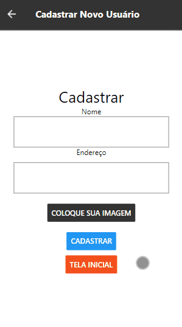
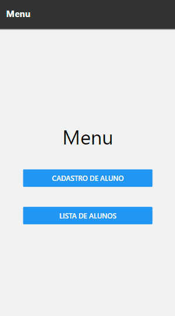

# 
 Crud React Native, Node adn MongoDB👋

 
 

## 🔍 About

This is a project made all by myself, where you can do all thing of the crud!

 
 

## 🚀 Demo

 

There's no demo, becose i can't give my api, but if you want to see this working, <a href="https://www.linkedin.com/in/gustavo-bacellar/?msgControlName=reply_to_sender&msgConversationId=6714883939833561088&msgOverlay=true">Get in touch!</a> 

 
 

 
 

## ✨ Technologies used on this projects

 

<ul>
 
    <li> React Native
    <li> Html / Css
    <li> Rest api
    <li> Node.js
    <li> MongoDB
    <li> Heroku
</ul>

 

 

 
Made with ♥ by Gustavo Bacellar 👋 <a href="https://www.linkedin.com/in/gustavo-bacellar/?msgControlName=reply_to_sender&msgConversationId=6714883939833561088&msgOverlay=true">Get in touch!</a>
